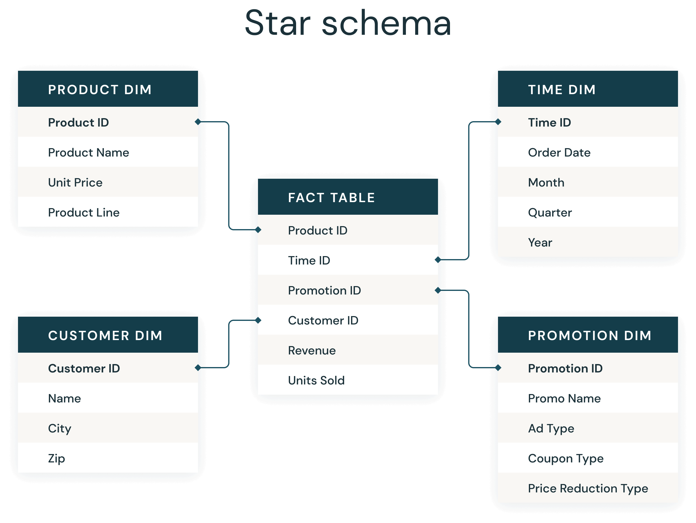
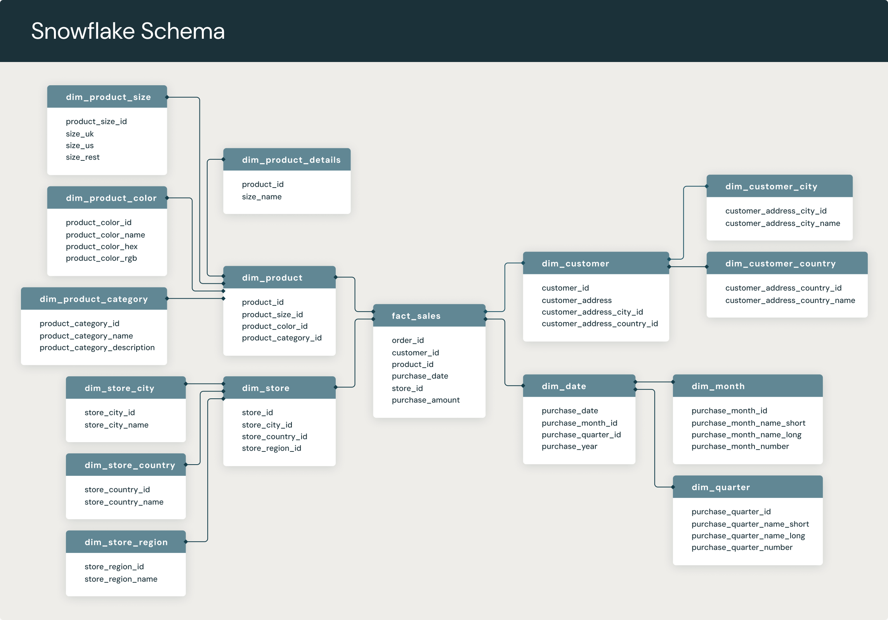
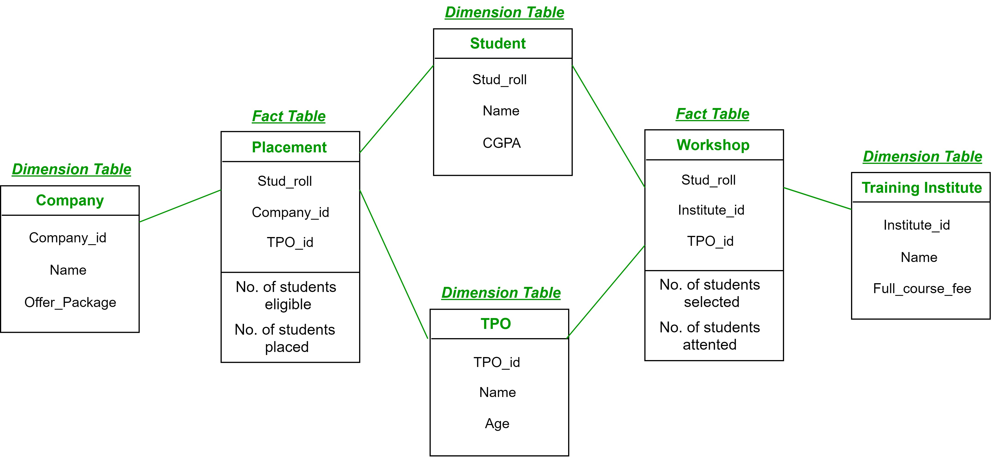
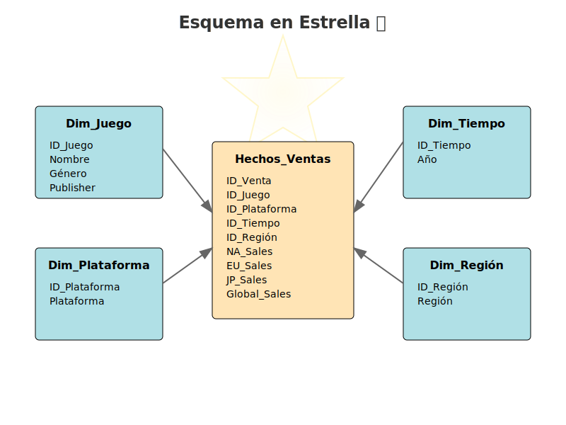
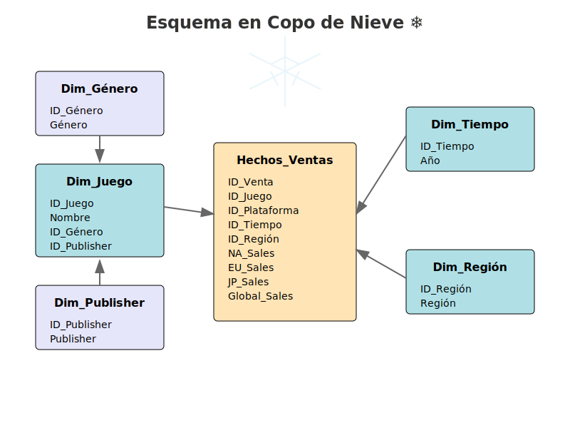

# Encabezados a Modelos BI

## Modelos BI

* Como recordatorio tenemos en cuenta que tenemos `3` modelos de negocio utilizables para la representación de `cubos multidimensionales`
  * `Estrella`
  * `Copo de nieve`
  * `Constelacion`

### Estrella

Siendo el modelo más básico de BI, aunque siendo básico no significa que no sea funcional, este busca que la medida a analizar este rodeada de todas sus dimensiones `sin normalizar` para que las `consultas` sean más simples y directas.

  

### Copo de Nieve

Una derivación del modelo `estrella`, aquí lo que se busca es una mejor distribución y estructuración de las dimensiones para mantener jerarquías y orden utilizando `normalización`. Agregado busca mejorar la redundancia de datos.

  

### Constelación

Este nace por el simple motivo del poder manejar dos o más tablas de `hechos`, los otros dos esquemas están limitados a solo una tabla de `hechos`, sin embargo, esto es lo que se busca, centralizarse en una medida y poder hacer análisis, pero muchas veces se requiere la comparativa y análisis de datos entre dos o mas medidas.

  

## Ejemplo

Tenemos una fuente de datos en formato `.csv` que tiene los siguientes encabezados y datos:

### **📌 Tabla Original (vgsales.csv)**

| Rank | Name | Platform | Year | Genre | Publisher | NA_Sales | EU_Sales | JP_Sales | Other_Sales | Global_Sales |
|------|--------------------------|----------|------|---------------|------------|----------|----------|----------|------------|--------------|
| 1    | Wii Sports               | Wii      | 2006 | Sports        | Nintendo   | 41.49    | 29.02    | 3.77     | 8.46       | 82.74        |
| 2    | Super Mario Bros.        | NES      | 1985 | Platform      | Nintendo   | 29.08    | 3.58     | 6.81     | 0.77       | 40.24        |
| 3    | Mario Kart Wii           | Wii      | 2008 | Racing        | Nintendo   | 15.85    | 12.88    | 3.79     | 3.31       | 35.82        |
| 4    | Wii Sports Resort        | Wii      | 2009 | Sports        | Nintendo   | 15.75    | 11.01    | 3.28     | 2.96       | 33.00        |
| 5    | Pokemon Red/Blue         | GB       | 1996 | Role-Playing  | Nintendo   | 11.27    | 8.89     | 10.22    | 1.00       | 31.37        |

Implementaremos `2` modelos de inteligencia de negocios:

---

### **📌 Esquema en Estrella** ⭐

### **Tabla de Hechos: `Hechos_Ventas`**
| ID_Venta | ID_Juego | ID_Plataforma | ID_Tiempo | ID_Región | NA_Sales | EU_Sales | JP_Sales | Other_Sales | Global_Sales |
|----------|---------|-------------|---------|---------|---------|---------|---------|---------|---------|

### **Tablas de Dimensiones (Desnormalizadas)**
#### **Dim_Juego**
| ID_Juego | Nombre | Género | Publisher |
|----------|--------|--------|-----------|

#### **Dim_Plataforma**
| ID_Plataforma | Plataforma |
|---------------|------------|

#### **Dim_Tiempo**
| ID_Tiempo | Año |
|-----------|-----|

#### **Dim_Región**
| ID_Región | Región |
|-----------|--------|

  

---

### **📌 Esquema en Copo de Nieve** ❄️

### **Tabla de Hechos: `Hechos_Ventas`**
| ID_Venta | ID_Juego | ID_Plataforma | ID_Tiempo | ID_Región | NA_Sales | EU_Sales | JP_Sales | Other_Sales | Global_Sales |
|----------|---------|-------------|---------|---------|---------|---------|---------|---------|---------|

### **Tablas de Dimensiones (Normalizadas)**
#### **Dim_Juego**
| ID_Juego | Nombre | ID_Género | ID_Publisher |
|----------|--------|-----------|--------------|

#### **Dim_Género**
| ID_Género | Género |
|-----------|--------|

#### **Dim_Publisher**
| ID_Publisher | Publisher |
|--------------|-----------|

#### **Dim_Plataforma**
| ID_Plataforma | Plataforma |
|---------------|------------|

#### **Dim_Tiempo**
| ID_Tiempo | Año |
|-----------|-----|

#### **Dim_Región**
| ID_Región | Región |
|-----------|--------|

  

